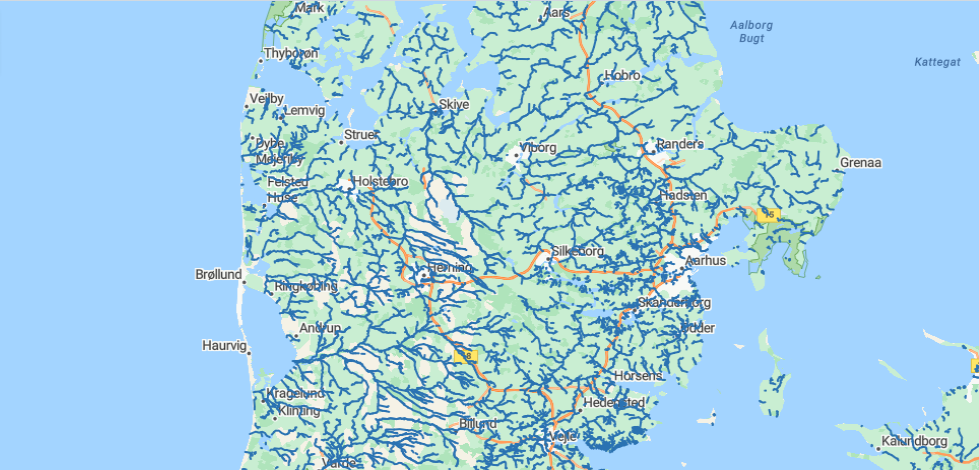
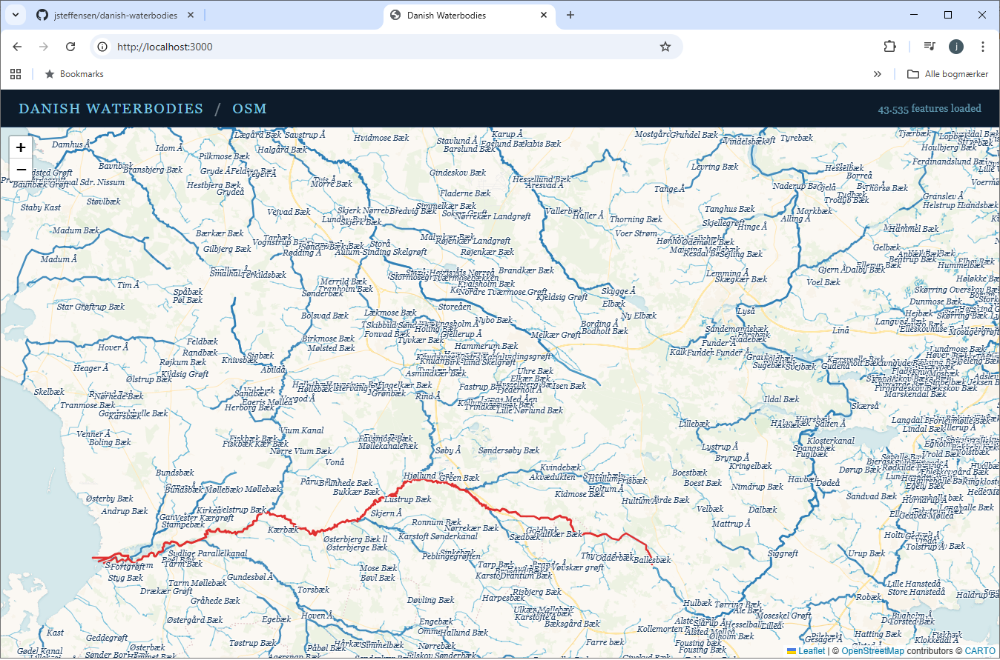

# danish-waterbodies

## Download water body data from overpass-turbo

* Go to https://overpass-turbo.eu/
Paste search

```
[out:json][timeout:1800];
area["ISO3166-1"="DK"][admin_level=2]->.searchArea;
(
  way["waterway"~"river|stream"](area.searchArea);
  relation["waterway"~"river|stream"](area.searchArea);
);
out body;
>;
out skel qt;
```
* Export as geojson
* Save as 'waterbodies_dk.geojson' (already in this repo)



## Run webserver

```npm install```

```node server.js```

## Go to localhost:3000

